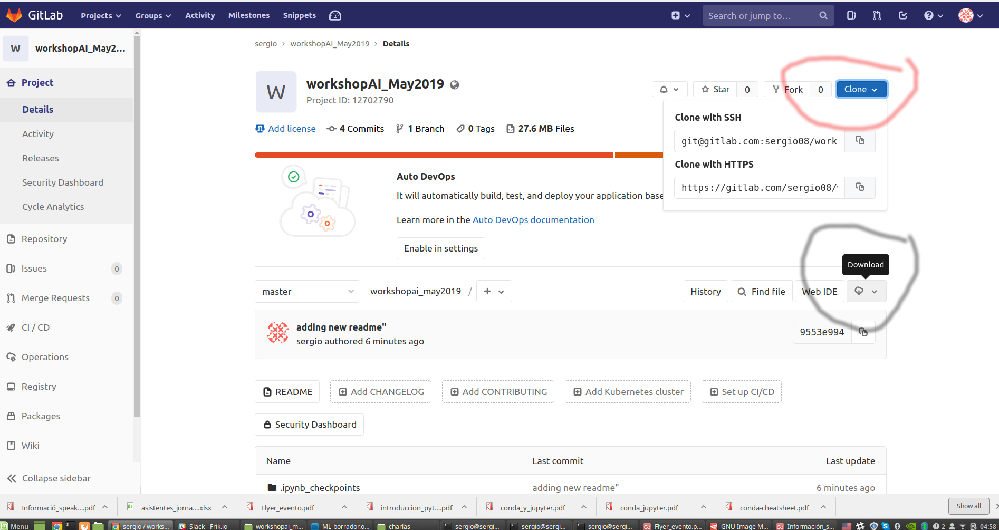
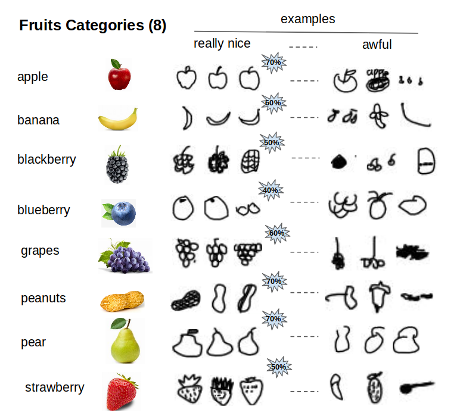

# Workshop: La Inteligencia Arti

# Agradecimientos
En nombre de todos los organizadores les agradecemos enormemente su participación y los envitamos a ponerse en contacto de cara a la organización de futuras meetups y workshops. 

# Frikio
Frikio es una red de personas apasionadas por el conocimiento del arte en las ciencias de
la tecnología, computación y salud. para suscribirte a la lista de emails, envianos un email a :
frikioai<arroba>gmail.com

# Acceso a las presentaciones del workshop :
[“Carpeta presentaciones”](https://gitlab.com/sergio08/workshopai_may2019/tree/master/presentaciones)
 
# Acceso al notebook utilizado en la sección práctica:
[“Carpeta notebooks”](https://gitlab.com/sergio08/workshopai_may2019/tree/master/notebooks)

Pasos a seguir para correr el notebook de la parte práctica: 

1) Instalar Python y conda en tu compu:

Quick-guide:
Install and running with Python
Suggested alternative: install Conda, create an environment with python and then run the example notebook using jupyter lab.
Quick install and some tips at Linux:
a) download miniconda installer:

wget https://repo.continuum.io/miniconda/Miniconda3-latest-Linux-x86_64.sh

b) install

bash Miniconda3-latest-Linux-x86_64.sh

c) Install supports for jupyter lab (more details at "https://github.com/jupyterlab/jupyterlab")

conda install -c conda-forge jupyterlab

d) create an environment (default Python 3.6.5)

conda create --name py36

e) open the environment and required packages

source activate py36

conda install -c numpy scipy matplotlib pandas scikit-learn ipython nbconvert tensorflow keras nb_conda opencv

conda install nb_conda 6) Finally, open jupyter lab and run the notebook(.ipynb)

For more informations using install using another OS "https://conda.io/docs/user-guide/install/index.html"

2) descargar el repositorio en tu computadora: Tenes almenos dos opciones
    
    a- utilizando el botton "download"

    b- instalar git y clonar el repositorio

   
3) Descomprimir los archivos del train y test

4) Iniciar jupyter lab dentro del proyecto y comenzar
    
# Dataset utilizado en la parte práctica
Consiste de imágenes de frutas que han sido obtenidas del proyecto de google labs "Quick Draw" (¿Lo conocés? , sino podes pegarle una mirada a este super interesante proyecto para ver de que se trata en:  https://quickdraw.withgoogle.com/data ). 

## Dataset
Con el objetivo de hacer las cosas un poco más sencillas, hemos generado un set de datos el cual está disponibilizado en su versión de imagen  (28 x 28 pixels, organizadas en carpetas llamadas con el nombre de la fruta en particular) 

| Name  | Content | amount | Size | Link|
| --- | --- |--- | --- |--- |
| `train.tar.gz`  | Imagenes de entrenamiento  | 12800 |4.9 MBytes | [Download](https://gitlab.com/sergio08/workshopai_may2019/blob/master/datasets/images/train.tar.gz)|
| `test.tar.gz`  | Imagenes de testeo  | 1600 |0.6  MBytes | [Download](https://gitlab.com/sergio08/workshopai_may2019/blob/master/datasets/images/test.tar.gz)|

## Categorías "Frutales"
Los distintos tipos de figuras seleccionadas corresponden a 8 tipos distintos de frutas : 

Herramientas y lugares donde encontrar más ejemplos e ideas de como encarar la parte práctica:
- kaggle: https://www.kaggle.com/
- Pytorch : https://pytorch.org/tutorials/beginner/pytorch_with_examples.html
- Tensorflow: https://www.tensorflow.org/
- Mxnet: http://mxnet.incubator.apache.org/
- Caffe: http://caffe.berkeleyvision.org/
- Theano: http://www.deeplearning.net/software/theano/

## Contacto por cualquier duda

